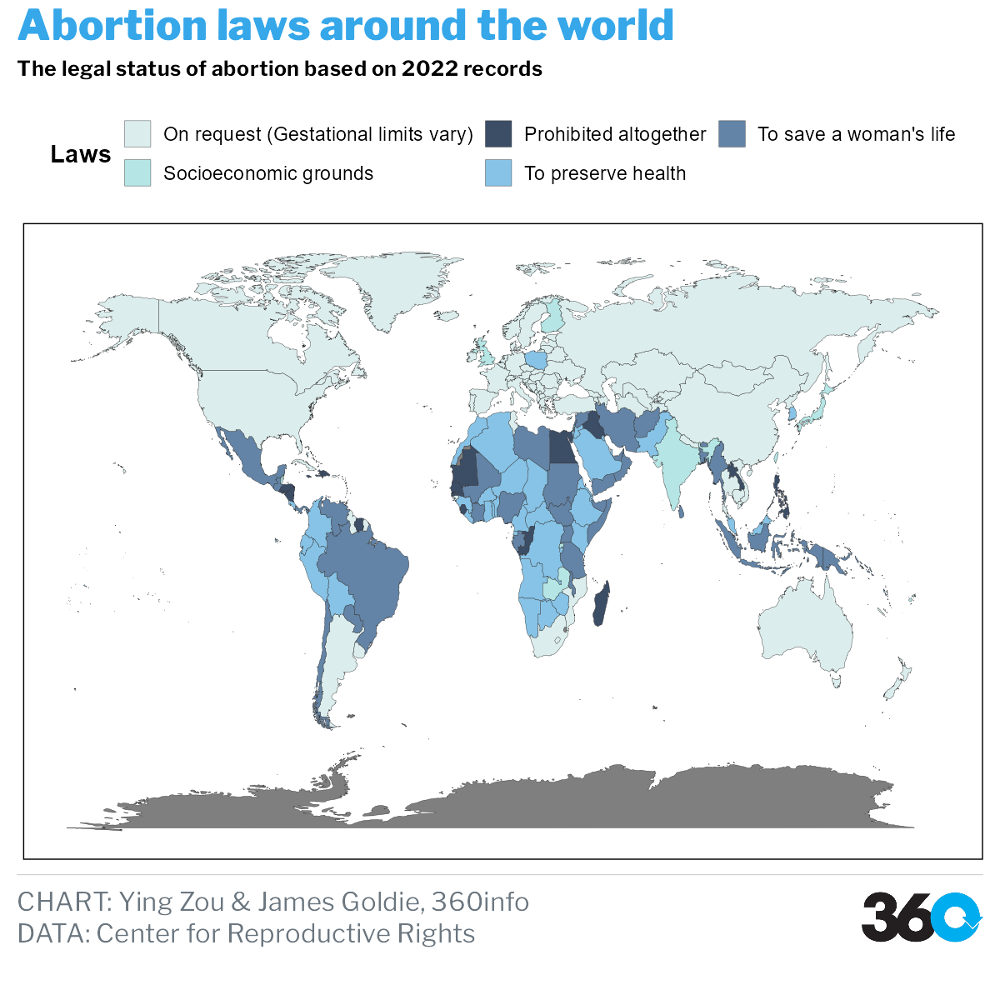

```{r setup, include=FALSE}

knitr::opts_chunk$set(echo=FALSE, 
                      messages=FALSE,
                      error = FALSE,
                      warning=FALSE,
                      eval= TRUE,
                      fig.align = "center")
```

```{r library, include=FALSE}
library(rmdformats)
library(tidyverse)
library(ggplot2)
library(tidyverse)
library(plotly)
library(here)
library(readr)
library(themes360info)
library(dplyr)
library(tibble)
library(kableExtra)
```

# Abstract

The purpose of this report is to discover the relationship between women's reproductive rights and other factors globally. The ultimate goal is to use the information gained to explore current issues and call for greater attention. The data used are related to the economic situation of each country, policies and regulations, abortion methods, etc. After tidying the data, we use data visualization methods to analyze and represent women's reproductive health issues.

In the process of the internship, we chose to use exploratory data analysis to ask questions about the political and economic impacts of the reproductive health. After data capture, we integrated and analyzed the collected data, especially after data visualization, combining data changes on maps and graphs, the answers to our questions could be more clearly presented.

Overall, female fertility is strongly related to the state of economic development of the country. At the same time, women's reproductive rights are not entirely in their own hands, but also subject to the constraints of state policy, while cases of women's death by sterilization due to the above-mentioned reasons is also a barriers to global reproductive health.

# Introduction

## Background

The annulment of the landmark 1973 U.S. Supreme Court decision Roe v. Wade made international headlines and sent a clear message - women's reproductive health remains heavily politicized and often out of their own hands. Good sexual reproductive services and knowledge are critical to women's overall health. and full reproductive rights - the legal protection for women to make choices about their own bodies - including access to birth control, sex education, family planning and safe abortion.

Economic factors also affect female fertility at the same time, as the productivity of women's labor is severely neglected, especially in times of economic crisis, exacerbating the reliance on and erasure of the female body. Economic austerity policies, including cuts in social welfare provisions and demands for more volunteer work, have also increased the pressure on women to have children. In addition, economically disadvantaged countries and regions do not provide good maternity protection (Elson 2010; UN Women 2014).

## Motivation

This internship report explores aspects around how economic and policy power affects women's reproductive health. Then concludes with a summary of the obstacles we need to overcome and what lessons can we take from it. Finally students summarize the skills that learned from the work, and the daily workload.

# Data

The data we used listed as follows:

-   WPP2019_FERT_F01_BIRTHS_BOTH_SEXES.csv

    -   Obtained from UNITED NATIONS,Population Division World Population Prospects 2019.

    -   https://population.un.org/wpp/Download/Standard/Fertility/

    -   This Data set records number of births over a given period(1950-2020). Refers to five-year periods running from 1 July to 30 June of the initial and final years. Data are presented in thousands. The data classify the number of births according to different regions: development groups, World Bank income groups, Geographic regions, Geographic regions. to describe the number of births between 1950 and 2022.

        ```{r}
        key <- tribble(
          ~Variable, ~Description,
          "Index", "Number",
          "Variant", "Estimate Number",
          "Region, subregion, country or area", "The location",
          "Notes", "Notes",
          "Country code", "Distinguish between different countries",
          "Type", "Different country type",
          "Parent code", "Different country code",
          "Number of births, both sexes combined (thousands)", "From 1950-2022") %>%
          as.data.frame()
        kable(key) %>%
          kable_styling("striped", position = 'center')
        ```

-   children-per-woman-UN.csv

    -   Obtained from Our World in Data, Population Division World Population Prospects 2019.

    -   https://ourworldindata.org/search?q=Fertility+Rate

    -   Data include:

        ```{r}
        key1<- tribble(
          ~Variable, ~Description,
          "Entity", "Country name",
          "Code", "Country code",
          "Year", "1950-2020",
          "Estimates", "Total fertility rate (number of live births per woman).") %>%
          as.data.frame()
        kable(key1) %>%
          kable_styling("striped", position = 'center')

        ```

# Analysis

Women's reproductive health and rights have long been a highly controversial topic around the world. Today, the topics of family planning resources and abortion are still highly controversial within the United States and worldwide, and women all over the world are not guaranteed access to vital reproductive health services (Galbraith, 2022).

Ensuring women's reproductive health rights is key to the progress of societies around the world, but many specific and objective factors come into play. For example, imbalances in state power, culture, economics, and religion all affect women's reproductive health and rights. For example, pervasive racism in the United States is a major cause of sexual and reproductive health disparities for African American women. A history of racial inferiority and low income exacerbates discriminatory health practices, which in turn negatively affects the quality and type of care provided to African American women. According to the Centers for Disease Control and Prevention, African American women bear a heavy burden of maternal and infant mortality as well as sexually transmitted infections, including HIV (Prather et al. 2018). Some religious countries also explicitly prohibit women from having abortions, and after the U.S. Constitution overturned Roe v. Wade, some Jews from the U.S. said the court, in denying the constitutional right to abortion, also denied religious freedom to American Jews.\
This part of the study will use data visualization in terms of the current state of global reproductive health, national policies and economics factors, as well as giving the specific steps and reflections during the process

## Global Reproductive Health Overview

```{r,fig.cap="World average female births",message=FALSE,warning=FALSE}
fertility_rate_total <- read_csv(here("data", "fertility_rate_total.csv"))

fertility_rate_total <-fertility_rate_total %>% pivot_longer(cols=everything(),names_to = "Years", values_to = "Number")


 
# fertility_rate_total$Years <- as.numeric()
# fertility_rate_total <- as.numeric(fertility_rate_total(Years))
fertility_rate_total$Years <- as.double(fertility_rate_total$Years)  


# df <- data.frame(Date=index(AAPL),coredata(AAPL)) #把index变成数据内容
# df1 <- tail(df, 30)
# #截取最后三十个
# df1$ID <- seq.int(nrow(df1))
# #在最后一列加上id，按照行数

accumulate_by <- function(dat, var) {
  var <- lazyeval::f_eval(var, dat)
  lvls <- plotly:::getLevels(var)
  dats <- lapply(seq_along(lvls), function(x) {
    cbind(dat[var %in% lvls[seq(1, x)], ], frame = lvls[[x]])
  })
  dplyr::bind_rows(dats)
}

f_r<-fertility_rate_total %>%
  accumulate_by(~Years) 

plot_f_r <- ggplot(f_r,aes(x=Years,y= Number,frame=frame)) +
  geom_line(color = "#87c3e6")
  # labs(title = "World average female births",
  #       subtitle = "Plot of length by dose",
  #       caption = "Data source: ToothGrowth")+
  # theme_360()

fig <- ggplotly(plot_f_r) %>%
  layout(
    title = "World average female births",
    yaxis = list(
      title = "Live births per woman",
      zeroline = F,
      tickprefix = "$"
    ),
    xaxis = list(
      title = "",
      zeroline = F,
      showgrid = F
    )
  ) %>%
  animation_opts(
    frame = 100, 
    transition = 0, 
    redraw = FALSE
  ) %>%
  animation_slider(
    currentvalue = list(
      # prefix = "Year"
    )
  )

fig


```

Women worldwide had an average of 4.9 children per person in 1955. In 1965, the number of women giving birth peaked in 70 years, with an average of 5 children per woman in her lifetime. The number of women's births declined sharply after 1970, with the decline accelerating between 1975 and 1980. After 1995, the decline became slower, with an average of three children per woman. This decline continues slowly after the millennium. Eventually, in 2020, the average number of children per woman was 2.4. Since the above picture does not allow us the details of the reasons, and since China as a populous country introduced family planning in 1971 and until the constitution in 1982, the number of newborns decreased significantly. Therefore, it will have a large impact on the average number of children born in the world. Therefore, we will discuss this issue further by dividing it into different regions.

```{r,region,fig.cap="Changes in the number of births in different regions",message=FALSE,warning=FALSE}
fertility_geographic <- read_csv(here("data", "worldbank_geographic.csv")) %>% 
pivot_longer(-Region,names_to = "Years", values_to = "number")
line_geo<- ggplot(fertility_geographic, aes(x = Years, y = number, color = Region)) +
  # geom_point()+
  geom_line(aes(group = 1))+
  # facet_wrap(~Region) +
  theme_bw() + theme(axis.text.x = element_text(angle = 90)) +
  ggtitle("Changes in the number of births in different regions
")

ggplotly(line_geo)
```

When the data is divided according to different regions, the births in different geographic areas are clear. It can be seen that Asia has the highest number of births, and the number of births has been declining since it peaked in 1990. Africa's birth population is growing over time. Latin America, North America and Oceania have been in a steady state.


```{r,fig.cap= "Number of birth women give worldwide",message=FALSE,warning=FALSE}
country <-read_csv(here("data", "fertilityrate_prosperity.csv"))

yield_graph = plot_geo(country,
                      locationmode = 'worldwide',
                      frame = ~Year) %>% 
  add_trace(locations = ~Code,
            z=~Estimates,
            zmin = 0,
            zmax = max(country$Estimates),
            color = ~Estimates)
yield_graph
```

In addition to looking at the world's fertility data in a linear chart, the map provides a better view of how the number of births to women in each country has changed over time. Again, we can see that the overall number of births in the world is declining, and again the map can easily answer the question raised earlier. The reason for the rapid decline in the number of women giving birth in the world between 1970 and 1980 is the fertility policies of China. Sliding the timeline, we can see that the color change in China is extremely obvious, with the average number of births declining rapidly. Also from the map it can be seen that women in Africa always have more children.

# Abortion Laws

This is the focus of this internship, and I am mainly responsible for how women's reproductive rights are affected by policies. When preparing this topic, my project manager and I agreed to use a map to express the definitive record of the legal status of abortion in countries across the globe.

```{r,fig.cap= "Abortion laws around the world demo",message=FALSE,warning=FALSE}
map_world <- map_data('world')
data <- read_csv(here("data","laws(2).csv"))
map_all2 <- left_join(map_world, data, by = c('region' = 'Entity'))


ggplot(map_all2, aes( x = long, y = lat, group = group )) +
  geom_polygon(aes(fill = number),color = "#272727",size = 0.1) +
  scale_fill_gradientn(colours = c( #"#7c9bfc","#465ba5","#192546","#140f07","#c4e9f9"
                                    #"#d9877e", "#ae5c6e","#784162", "#513552" ,"#d6b378" 
                                    '#461863','#404E88','#2A8A8C','#7FD157','#F9E53F'
                                   )
                       ,values = scales::rescale(c(1,2,3,4,5))
                       ,labels = c("On Request (Gestational Limits Vary)"
                                   ,"Prohibited altogether"
                                   ,"To save a woman's life"
                                   ,"Socioeconomic Grounds"
                                   ,"To Preserve Health"
                                   )
                       ,breaks = c(1,2,3,4,5)
  ) +
  guides(fill = guide_legend(reverse = T)) +
  labs(fill = 'laws'
       ,title = 'The World’s Abortion Laws'
       ,subtitle = 'The definitive record of the legal status of abortion in countries across the globe '
       ,x = NULL
       ,y = NULL) +
  theme(text = element_text(family = 'Gill Sans', color = 'black')
        ,plot.title = element_text(size = 28)
        ,plot.subtitle = element_text(size = 14)
        ,axis.ticks = element_blank()
        ,axis.text = element_blank()
        ,panel.grid = element_blank()
        ,panel.background = element_rect(fill = 'white')
        ,plot.background = element_rect(fill = 'white')
        ,legend.position = c(.18,.36)
        ,legend.background = element_blank()
        ,legend.key = element_blank()
  ) +
  annotate(geom = 'text'
           ,label = 'Source: https://reproductiverights.org/maps/worlds-abortion-laws/?category[1348]=1348&category[1350]=1350&category[1352]=1352'
           ,x = -80, y = -60
           ,size = 3
           ,family = 'Gill Sans'
           ,color = 'black'
           ,hjust = 'left'
  )
```

-   Abortion laws of the world\
    The World Map of Abortion Law depicts the definitive record of the legal status of abortion in countries around the globe. The establishment of abortion rights should be the standard for the human rights guaranteed to women and girls globally. The map classifies the legal status of abortion on a continuum from severely restrictive to relatively lenient. Native is the most recent data available, reflecting changes in national laws and hopefully monitoring how countries are protecting or denying reproductive rights around the world.

-   How the law changes\
    Over the past few decades, significant gains have been made in ensuring women's right to abortion, with nearly 50 countries liberalizing their abortion laws. Some of these reforms have been incremental, making legal abortion available to women only when their lives are threatened or when they become pregnant as a result of rape. But many of these changes have been truly transformative, overturning absolute bans on abortion and favoring women's reproductive autonomy.

-   This chart initially had missing values and many of the countries were not successfully colored. I found that it was the reason that the information in the data table did not correspond, and I changed the errors in the data. Make sure that the country names and latitude and longitude values are accurate.

```{r,fig.cap= "Abortion laws around the world",message=FALSE,warning=FALSE}
map_world <- map_data('world')
data <- read_csv(here("data","laws(2).csv"))

map_all <- left_join(map_world, data, by = c('region' = 'Entity'))


p <- ggplot(map_all, aes( x = long, y = lat, group = group )) +
  geom_polygon(aes(fill = number),color = "#272727",size = 0.1) +
  scale_fill_gradientn(colours = c('#dceded','#3c4d66', '#6384a6','#b5e6e5','#87c3e6'),#1,5,4,2,3
values = scales::rescale(c(1,2,3,4,5)),
labels = c("On request (Gestational limits vary)"
                                   ,"Prohibited altogether"
                                   ,"To save a woman's life"
                                   ,"Socioeconomic grounds"
                                   ,"To preserve health"
                                   ), breaks = c(1,2,3,4,5)) +
  guides(fill = guide_legend(reverse = T))+
  theme(legend.position = "top")+
  guides(fill=guide_legend(nrow=2, byrow=TRUE))+
  theme_360()+
  labs(fill = 'Laws'
       ,title = 'Abortion laws around the world'
       ,subtitle = 'The legal status of abortion based on 2022 records',
       caption = " **CHART:** Ying Zou & James Goldie, 360info  <br> 
                  **DATA:** Center for Reproductive Rights",
       x = NULL,
       y = NULL) +
  theme(text = element_text(family = 'Gill Sans', color = 'black'),
        plot.title = element_text(size = 28),
        plot.subtitle = element_text(size = 14),
        axis.ticks = element_blank(),
        axis.text = element_blank(),
        panel.grid = element_blank(),
        panel.background = element_rect(fill = 'white'),
        plot.background = element_rect(fill = 'white'),
        legend.position = "top",
        legend.background = element_blank(),
        legend.key = element_blank())
  # annotate(geom = 'text',label = 'Source: Center for Reproductive Rights (1992-2021)',x = -80, y = -60,size = 3,family = 'Gill Sans',color = 'black',hjust = 'left')

# p+theme_360()
save_360plot(p, "man/figures/README-demo.png")

```

* Access to safe and legal abortion is a fundamental human right that is protected by many of the world's international and regional human rights treaties, as well as by national-level constitutions. These instruments situate safe abortion among a range of rights, including the right to life, the right to liberty, the right to privacy, the right to equality and non-discrimination, and the right to be free from cruel, inhuman and degrading treatment. Human rights bodies have repeatedly denounced restrictive abortion laws as inconsistent with human rights norms.  

The legal status of abortion reveals that the law does not only allow women and girls to decide whether to terminate a pregnancy. It also reveals that women are at risk of dying from unsafe abortions, girls are at risk of not completing their education, and women and girls are limited in their ability to participate in public and political life. In short, the legal status of abortion tracking shows us where women and girls are treated equally and have the opportunity to direct their own lives (Center for Reproductive Rights,2021).

-   In order to see more clearly how fertility policies differ in the world, we colored the title map into gradient colors according to the strictness of the fertility policies, changed the title and text as requested by the project team, and finally nested the 360info theme.

-   This map has been published on https://360info.org/

# Fertility rate and national economy

```{r,fig.cap= "Abortion laws around the world",message=FALSE,warning=FALSE}
fertility_develop <- read_csv(here("data", "fertility_development.csv")) %>% 
pivot_longer(-Region,names_to = "Years", values_to = "number")
```

```{r,fig.cap= "Trend for number of birth of each development group",message=FALSE,warning=FALSE}
line_develop<- ggplot(fertility_develop, aes(x = Years, y = number, color = Region)) +geom_point()+
  geom_line(aes(group = 1))+
  # facet_wrap(~Region) +
  theme_bw() + theme(axis.text.x = element_text(angle = 90)) +
  ggtitle("Trend for number of birth of each development group
")+
  theme(legend.position = "top")

ggplotly(line_develop)
#数据解释看fertility的数据的最后一页
```
The difference between less developed countries and less developed countries, including China, in the graph is the number of births in China. It can be seen that the number of births in less developed countries is increasing, while China's policies interfere with the accuracy of the data, resulting in a decreasing trend in the number of births in China. In addition, the trend of less developed regions and less developed regions,excluding least developed country is similar.

```{r,fig.cap= "Number of births at different income levels over the time",message=FALSE,warning=FALSE}


fertility_income <- read_csv(here("data", "worldbank_incomegroup.csv")) %>% 
pivot_longer(-Region,names_to = "Years", values_to = "number")
line_income<- ggplot(fertility_income, aes(x = Years, y = number, color = Region)) +
  # geom_point()+
  geom_line(aes(group = 1))+
  # facet_wrap(~Region) +
  theme_bw() + theme(axis.text.x = element_text(angle = 90)) +
  ggtitle("Number of births at different income levels over the time")

ggplotly(line_income)
#数据解释看fertility的数据的最后一页


```
The graph shows that both high-income countries and countries without income have low numbers of births. The middle-income countries are the main fertility producers in the world. We can observe that the fertility rate in middle and upper middle-income countries has been decreasing since 1990. Contrary to the general trend of births in the world, the number of births in low-income and lower-middle-income countries has been increasing year by year.

# Workload undertaken  

I have gained a lot from this two-month internship. 360info is a research-oriented, solution-focused global information agency, where we are responsible for our own assigned topics and give data support to the content of the articles to match the publication schedule of the writers. Presented in a data visualization format. My project manager helped me a lot in finding data sets related to reproductive rights and showed me where the data is accurate and how to look at the certificates of the data. Since the main part of our internship was to publish our visualizations in articles. Therefore, when performing data analysis, I believe that line graphs and maps are the best representation of geographic, policy information, as well as timeserise

# Conclusion

As a result of the above analysis, the current situation of female fertility in the world is that the number of newborns is showing an overall decreasing trend. However, in some low-income countries in Africa, the number of births is increasing over time. In addition, China's family planning efforts are clearly controlling the population, so that the average birth rate in Asia and the world is affected, as shown by the similar trend in the curve of the number of newborns. Reproductive health is also affected by the policies of individual countries, with more births occurring in the United States after the repeal of the Constitution legalizing abortion. 

The limitations of this study are that reproductive health issues are not only economic and policy issues, but are also influenced by religion, culture, and other human factors. In addition, abortion is a more private topic, so the data collected may be less than the real data.


# References

Prather C, Fuller.R T, JeffriesIV L, Khiya J. Marshall, A. Vyann Howell, Angela Belyue-Umole, and Winifred King.Health Equity.Dec 2018.249-259. Retrieved from http://doi.org/10.1089/heq.2017.0045

Galbraith A. (2022). The Global Gag Rule: An Ideological Policy's Consequences for
Reproductive and Global Health. University of Puget Sound. Retrieved from https://soundideas.pugetsound.edu/cgi/viewcontent.cgi?article=1104&context=writing_awards 

Tanyag M. (2017). Invisible labor, invisible bodies: how the global political economy affects reproductive freedom in the Philippines, International Feminist Journal of Politics, 19:1, 39-54, DOI: 10.1080/14616742.2017.1289034

The World’s Abortion Laws. (2021). Retrieved from https://reproductiverights.org/maps/worlds-abortion-laws/?category[1348]=1348&category[1350]=1350&category[1352]=1352


