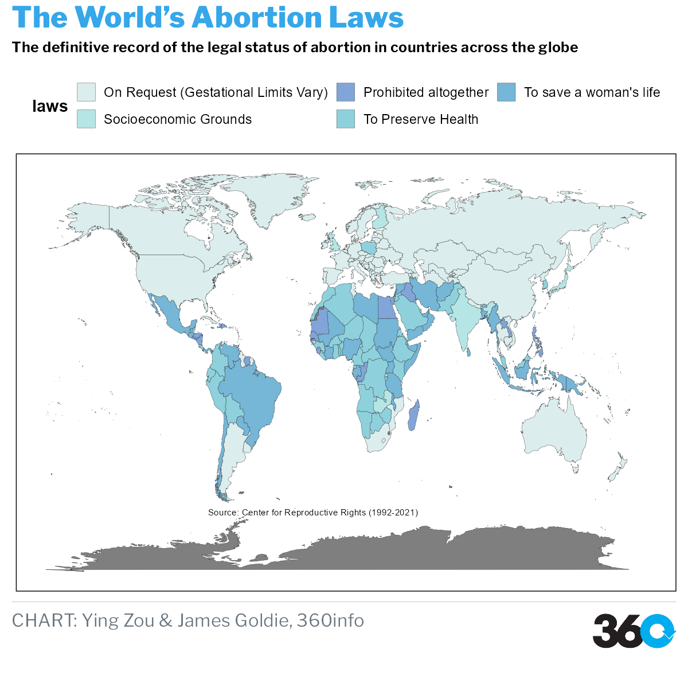

# Pregnancy and choice

The purpose of this report is to discover the relationship between women’s reproductive rights and other factors globally. The ultimate goal is to use the information gained to explore current issues and call for greater attention. The data used are related to the economic situation of each country, policies and regulations, abortion methods, etc. After tidying the data, we use data visualization methods to analyze and represent women’s reproductive health issues.

In the process of the internship, we chose to use exploratory data analysis to ask questions about the political and economic impacts of the reproductive health. After data capture, we integrated and analyzed the collected data, especially after data visualization, combining data changes on maps and graphs, the answers to our questions could be more clearly presented.

Overall, female fertility is strongly related to the state of economic development of the country. At the same time, women’s reproductive rights are not entirely in their own hands, but also subject to the constraints of state policy, while cases of women’s death by sterilization due to the above-mentioned reasons is also a barriers to global reproductive health.



## Data sources

* The data we used listed as follows:

WPP2019_FERT_F01_BIRTHS_BOTH_SEXES.csv

Obtained from UNITED NATIONS,Population Division World Population Prospects 2019.

https://population.un.org/wpp/Download/Standard/Fertility/

This Data set records number of births over a given period(1950-2020). Refers to five-year periods running from 1 July to 30 June of the initial and final years. Data are presented in thousands. The data classify the number of births according to different regions: development groups, World Bank income groups, Geographic regions, Geographic regions. to describe the number of births between 1950 and 2022.

* children-per-woman-UN.csv

Obtained from Our World in Data, Population Division World Population Prospects 2019.

https://ourworldindata.org/search?q=Fertility+Rate

## Use + Remix rights

](https://mirrors.creativecommons.org/presskit/buttons/80x15/png/by.png)

These charts, as well as the analyses that underpin them, are available under a Creative Commons Attribution 4.0 licence. This includes commercial reuse and derivates.

<!-- Do any of the data sources fall under a different licence? If so, describe the licence and which parts of the data fall under it here! if most of it does, change the above and replace LICENCE.md too -->

Data in these charts comes from:

* Data sources here (with links!)

**Please attribute 360info and the data sources when you use and remix these visualisations.**

## Reproduce the analysis

We typically publish graphics using [Quarto](https://quarto.org) notebooks, which can be found in the`*.qmd` files. Quarto allows reproducible analysis and visualisation to be done in a mix of languages, but we typically use [R](https://r-project,.org) and [Observable JS](https://observablehq.com/@observablehq/observables-not-javascript).

You'll need to:
- [Download and install Quarto](https://quarto.org/docs/get-started)
- [Download the install R](https://www.r-project.org)
- Satisfy the R package dependencies. In R:
  * Install the [`renv`](https://rstudio.github.io/renv) package with `install.packages("renv")`,
  * Then run `renv::restore()` to install the R package dependencies.
  * (For problems satisfying R package dependencies, refer to [Quarto's documentation on virtual environments](https://quarto.org/docs/projects/virtual-environments.html).)

Now, render the `.qmd` files to the `/out` directory with:

```sh
quarto render
```

## Help

<!-- replace `report-template` with the name of this repo in the link below  -->

If you find any problems with our analysis or charts, please feel free to [create an issue](https://github.com/360-info/report-template/issues/new)!
