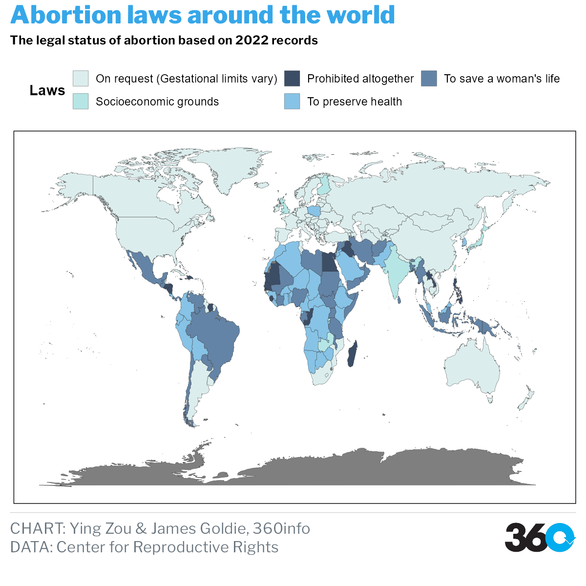

```{r setup, include=FALSE}
knitr::opts_chunk$set(echo = TRUE)
```


```{r}
library(ggplot2)
library(themes360info)
library(gapminder)
library(readr)
library(here)
library(dplyr)
library(tidyverse)
map_world <- map_data('world')
data <- read_csv(here("data","laws(2).csv"))

map_all <- left_join(map_world, data, by = c('region' = 'Entity'))


p <- ggplot(map_all, aes( x = long, y = lat, group = group )) +
  geom_polygon(aes(fill = number),color = "#272727",size = 0.1) +
  scale_fill_gradientn(colours = c('#dceded','#3c4d66', '#6384a6','#b5e6e5','#87c3e6'),#1,5,4,2,3
values = scales::rescale(c(1,2,3,4,5)),
labels = c("On request (Gestational limits vary)"
                                   ,"Prohibited altogether"
                                   ,"To save a woman's life"
                                   ,"Socioeconomic grounds"
                                   ,"To preserve health"
                                   ), breaks = c(1,2,3,4,5)) +
  guides(fill = guide_legend(reverse = T))+
  theme(legend.position = "top")+
  guides(fill=guide_legend(nrow=2, byrow=TRUE))+
  theme_360()+
  labs(fill = 'Laws'
       ,title = 'Abortion laws around the world'
       ,subtitle = 'The legal status of abortion based on 2022 records',
       caption = " **CHART:** Ying Zou & James Goldie, 360info  <br> 
                  **DATA:** Center for Reproductive Rights",
       x = NULL,
       y = NULL) +
  theme(text = element_text(family = 'Gill Sans', color = 'black'),
        plot.title = element_text(size = 28),
        plot.subtitle = element_text(size = 14),
        axis.ticks = element_blank(),
        axis.text = element_blank(),
        panel.grid = element_blank(),
        panel.background = element_rect(fill = 'white'),
        plot.background = element_rect(fill = 'white'),
        legend.position = "top",
        legend.background = element_blank(),
        legend.key = element_blank())
  # annotate(geom = 'text',label = 'Source: Center for Reproductive Rights (1992-2021)',x = -80, y = -60,size = 3,family = 'Gill Sans',color = 'black',hjust = 'left')

# p+theme_360()
save_360plot(p, "man/figures/README-demo.png")

```

